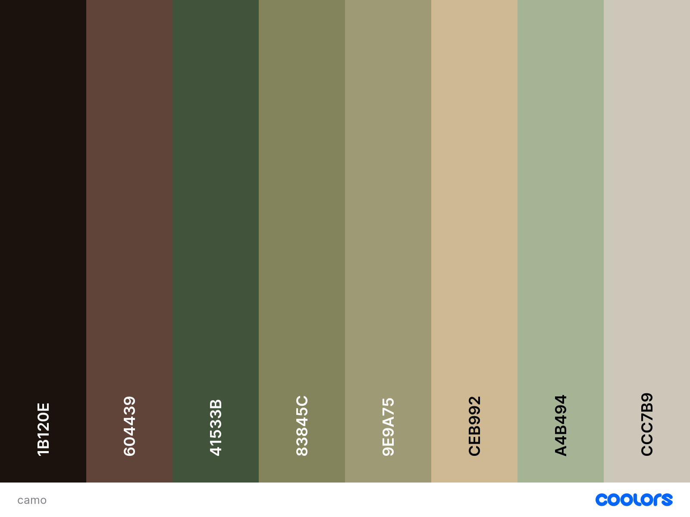

# camo

a camouflage-inspired colour theme for vscode

[[vscode extension]](https://marketplace.visualstudio.com/items?itemName=jonahseguin.camo)

## Colour Palette

[(Coolors palette)](https://coolors.co/1b120e-604439-41533b-83845c-9e9a75-ceb992-a4b494-ccc7b)

- **Licorce**: `#1B120E`
- **Liver**: `#604439`
- **Hunter Green**: `#41533B`
- **Reseda Green**: `#83845C`
- **Moss Green**: `#9E9A75`
- **Khaki**: `#CEB992`
- **Sage**: `#A4B494`
- **Bone**: `#CCC7B9`

